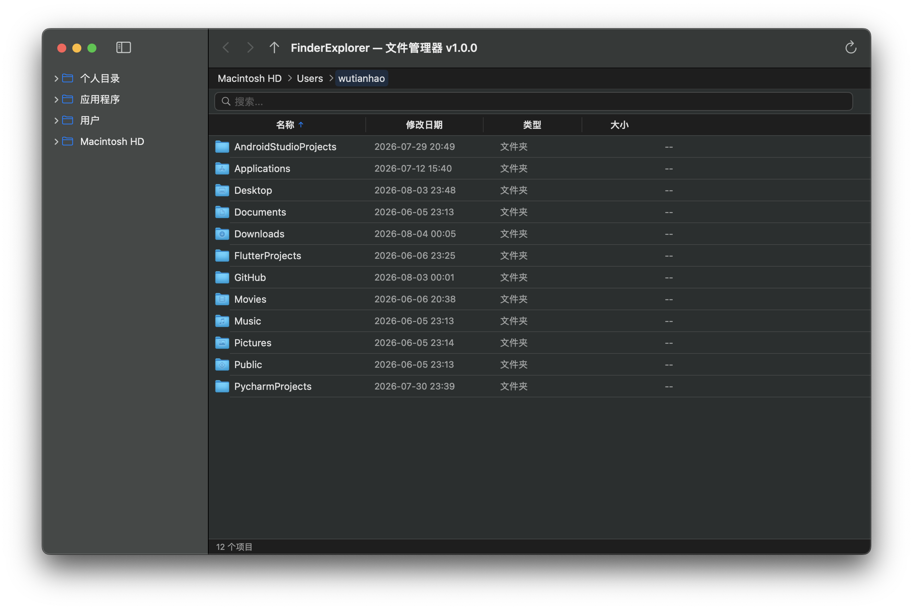

# FinderExplorer

一个用 SwiftUI 构建的 macOS 文件管理器，风格类似 Finder，支持树形侧边栏、面包屑导航、多选、内联重命名等功能。

## 截图



## 相比访达（Finder）的优势

| | Finder | FinderExplorer |
|---|---|---|
| **地址栏** | 右键 Option 才能看到路径，复制不方便 | 点击空白即切换为可编辑路径，自动全选，一键复制 |
| **目录树** | 侧边栏仅收藏夹，无完整目录树 | 完整目录树，根节点直达 /、/Users、/Applications |
| **排序** | 分组 + 排序混合，不可按列头切换 | 四列表格，点击列头一键切换排序方向和字段 |
| **键盘操作** | 仅 Enter 打开、Space 预览 | 全键盘：↑↓ 导航、Enter 打开、Backspace 返回上级、F2 重命名 |
| **多列信息** | 需切换为列表视图，且不显示类型 | 名称、日期、类型、大小四列同时可见 |
| **右键菜单** | 服务菜单分散、无废纸篓 | 集中管理：打开、重命名、Finder 中显示、复制路径、废纸篓 |
| **目录刷新** | 有时不自动刷新 | 文件系统事件驱动，自动刷新 |
| **跨平台潜力** | macOS 专属 | SwiftUI 跨平台架构，未来可移植 |

## 功能

- **侧边栏目录树** — 异步加载，支持展开/折叠子文件夹
- **可编辑地址栏** — 点击空白区域切换为文本输入，自动全选，支持复制/粘贴路径，Enter 导航、Esc 取消
- **文件列表** — 名称/修改日期/类型/大小四列，支持点击列头排序
- **搜索过滤** — 实时搜索当前目录下的文件
- **右键菜单** — 打开、重命名、在 Finder 中显示、复制路径、移到废纸篓
- **键盘导航** — 上下箭头选择、回车打开、Backspace 返回上级、F2 重命名
- **多选** — ⌘ Command 追加 / ⇧ Shift 范围选择
- **内联重命名** — 在列表中直接编辑文件名
- **新建文件夹** — 快捷创建并自动选中
- **前进/后退** — 导航历史栈，工具栏按钮操作
- **废纸篓** — 菜单命令 + ⌫ Delete 快捷键
- **目录自动刷新** — 外部文件新增/删除时列表自动更新
- **关于窗口** — 显示版本号、作者和项目主页链接
- **版本管理** — AppVersion.swift 统一版本号，窗口标题和打包产物自动同步

## 系统要求

- macOS 14.0 (Sonoma) 或更高版本

## 构建 & 运行

### 方式一：直接构建运行

```bash
./build_and_run.sh
```

### 方式二：手动构建

```bash
swift build --disable-sandbox
open .build/x86_64-apple-macosx/debug/FinderExplorer
```

## 打包为 .app

```bash
./package_app.sh
```

打包后的 `FinderExplorer-1.0.0.app`（版本号自动从 AppVersion.swift 读取）可以直接双击运行，或拖入 `/Applications`。

也可以从 [Releases](https://github.com/cnwutianhao/finder-explorer/releases/tag/1.0.0) 下载预编译版本。

## 项目结构

```
FinderExplorer/
├── Package.swift                 # Swift Package Manager 配置
├── build_and_run.sh              # Debug 构建 + 启动
├── package_app.sh                # Release 打包 .app
├── generate_icon.swift           # 用代码生成 App 图标
└── Sources/FinderExplorer/
    ├── AppVersion.swift          # 版本号定义
    ├── FinderExplorerApp.swift   # 入口 + 主窗口
    ├── Models/
    │   ├── FileItem.swift        # 文件/文件夹数据模型
    │   ├── SortOptions.swift     # 排序选项与方向
    │   └── TreeNode.swift        # 侧边栏树节点（异步）
    ├── Services/
    │   ├── FileSystemService.swift # 文件操作服务层
    │   └── NavigationState.swift   # 前进/后退导航栈
    └── Views/
        ├── MainContentView.swift  # 主区域整合
        ├── BreadcrumbBar.swift    # 面包屑地址栏
        ├── FileListView.swift     # 文件列表 + 右键菜单
        └── SidebarTreeView.swift  # 侧边栏目录树
```

## 技术栈

- **SwiftUI** — 原生声明式 UI
- **AppKit** — `NSWorkspace` 获取文件图标、`NSEvent` 键盘监听
- **SF Symbols** — 系统图标
- **Swift 6.0** — 结构化并发 (`async/await`)、`@MainActor`

## 许可

MIT
